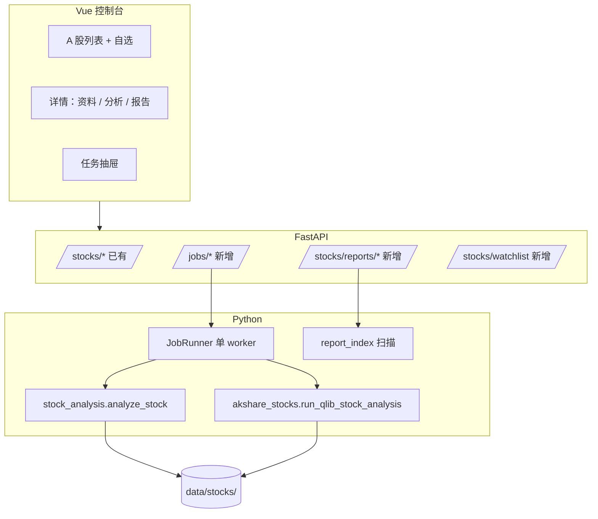

# A 股专业投研工作台 — 设计规格（C 定位 · Phase 1）

## 背景

`quant-rd-tool` 已具备 A 股数据与 qlib 分析能力：

- **公司库**：`akshare_stocks` — 列表缓存、profile（东财+巨潮）、管理层、新闻、公告
- **深度分析**：`stock_analysis.analyze_stock` — CSV + qlib dump + 技术/风险/ML → `report.json` / `report.md`
- **API**：`GET /api/v1/stocks/*`，`POST /api/v1/stocks/qlib-analyze/{code}`（同步，可耗时数分钟）
- **前端**：`AStockListView`（列表 + Qlib 弹窗）、`AStockDetailView`（资料/新闻/公告，无分析 Tab）

**产品定位（已确认）**：**C — 个人 / 小团队专业工具**。不做多租户、RBAC、计费；强调本地可跑、长任务可靠、投研工作流顺畅。

**Phase 1 优先级（已确认）**：**1 — A 股投研**（公司库 + Qlib/分析任务 + 报告历史）。Crypto 交易运营、统一 Macro UI 延后至 Phase 2+。

---

## 总体目标（Phase 1）

把「查公司 → 跑分析 → 回看报告 → 管自选」串成**一条不中断的工作台**，解决当前痛点：

| 痛点 | 目标 |
|------|------|
| Qlib/analyze 同步 HTTP 易超时、无进度 | 异步 Job + 进度/日志 |
| 报告散落在 `data/stocks/{qlib_code}/`，UI 不可浏览 | 报告库 API + 详情页「分析」Tab |
| 无自选、无批量 | 本地自选列表 + 批量入队分析 |
| 东财/代理失败（ProxyError） | 统一网络配置、重试、可跳过 enrichment |
| 列表页 Qlib 与详情页割裂 | 详情页内嵌分析；列表保留快捷入口 |

**非目标（Phase 1 不做）**

- 用户账号、团队权限、审计中心
- PostgreSQL / 云端同步（继续 `data/` 本地优先）
- 实时行情推送、Level-2
- 自动下单、组合回测 UI（保留 CLI/API，UI 后续）

---

## 关键决策

| 项 | 决策 | 理由 |
|----|------|------|
| 任务存储 | **SQLite** `data/jobs/jobs.db` | 单机可靠、可查询历史；比纯 JSON 易过滤 |
| 任务执行 | **进程内 BackgroundTasks + 单 worker 锁** | C 定位无需 Celery；后续可换 Redis 队列 |
| 长任务 API | **默认异步**；保留 `?sync=true` 兼容脚本 | 前端默认 `job_id` 轮询 |
| 报告索引 | **扫描 `data/stocks/*/report.json` + meta** | 不重复存大对象；Job 完成写 `meta.json` |
| 自选 | **`data/stocks/watchlist.json`** | 简单可备份；导出进 settings 包 |
| 网络 | **读取 `HTTP_PROXY` / 设置页 + `NO_PROXY` 国内域** | 缓解 ProxyError；文档说明关闭系统代理 |
| 批量分析 | **队列 FIFO，默认并发 1** | qlib/akshare 吃 CPU；可配置 `max_concurrent=1` |

---

## 架构



### 模块边界

| 模块 | 职责 |
|------|------|
| `job_store.py` | SQLite CRUD、状态机、列表过滤 |
| `job_runner.py` | 取 queued → running → 调业务函数 → done/failed |
| `report_index.py` | 列举/读取报告摘要、最新一条、按 code 聚合 |
| `watchlist.py` | 自选 CRUD |
| `routes/jobs.py` | Job HTTP |
| `routes/stocks.py` | 扩展 reports、watchlist、批量入队 |
| 前端 `api/jobs.ts`、`views/AStock*` | 任务与报告 UX |

---

## 数据模型

### Job 表 `jobs`

| 字段 | 类型 | 说明 |
|------|------|------|
| `id` | TEXT PK | UUID |
| `type` | TEXT | `analyze_stock` \| `qlib_analyze` \| `batch_qlib` |
| `code` | TEXT | 标的代码（batch 可为空） |
| `payload` | JSON | 请求体快照 |
| `status` | TEXT | `queued` \| `running` \| `done` \| `failed` \| `cancelled` |
| `progress` | REAL | 0–1，可选 |
| `message` | TEXT | 当前步骤文案 |
| `result_path` | TEXT | 如 `data/stocks/SH600519/report.json` |
| `error` | TEXT | 失败摘要 |
| `created_at` / `updated_at` | TEXT ISO | |

### Watchlist `data/stocks/watchlist.json`

```json
{
  "updated_at": "2026-05-29T12:00:00Z",
  "items": [{ "code": "600519", "name": "贵州茅台", "added_at": "..." }]
}
```

### 报告索引（运行时）

从 `data/stocks/{qlib_code}/` 读取：

- `report.json` — 摘要字段：`symbol`, `period`, `stance`, `summary`, `generated_at`（若无则从 mtime 推断）
- `report.md` — 详情页 Markdown 预览
- `meta.json` — 已有则合并 Job 的 `job_id`

---

## API 设计（新增/变更）

### Jobs

| 方法 | 路径 | 说明 |
|------|------|------|
| POST | `/api/v1/jobs/analyze-stock` | body 同 `POST /analyze/stock`，返回 `{ job_id }` |
| POST | `/api/v1/jobs/qlib-analyze` | body: `{ code, years, ... }` |
| POST | `/api/v1/jobs/batch-qlib` | `{ codes: string[], ... }` → 多个 job 或父 job + 子任务 |
| GET | `/api/v1/jobs/{id}` | 状态 + message + result 摘要 |
| GET | `/api/v1/jobs` | `?status=&type=&limit=` 列表 |
| POST | `/api/v1/jobs/{id}/cancel` | 仅 `queued` 可取消 |

### Reports

| 方法 | 路径 | 说明 |
|------|------|------|
| GET | `/api/v1/stocks/reports` | 分页列表（code, name, stance, date） |
| GET | `/api/v1/stocks/{code}/reports/latest` | 最新 report 摘要 + md 路径 |
| GET | `/api/v1/stocks/{code}/reports/{id}` | 按 job_id 或时间戳取历史（Phase 1 可先仅 latest + 文件 mtime 列表） |

### Watchlist

| 方法 | 路径 | 说明 |
|------|------|------|
| GET | `/api/v1/stocks/watchlist` | |
| POST | `/api/v1/stocks/watchlist` | `{ code }` 添加 |
| DELETE | `/api/v1/stocks/watchlist/{code}` | |

### 现有接口

- `POST /stocks/qlib-analyze/{code}`：**改为内部调 Job**（默认 202 + job_id）；`Sync` 头或 query `sync=1` 保持阻塞行为。
- `GET /stocks/{code}/profile`：失败时 **503 + 明确 proxy 提示**（已有，增强文案）。

---

## 前端设计（Phase 1）

### 1. A 股列表 `AStockListView`

- 顶栏 Tab：**全部** | **自选**
- 行操作：加入/移出自选、**分析**（入队 Job）、打开详情
- 批量：多选 → 「批量 Qlib 分析」→ 确认 → 任务抽屉
- Qlib 弹窗：改为「提交任务」+ 跳转任务抽屉（保留简易结果预览）

### 2. 详情页 `AStockDetailView`

- 新 Tab **「分析」**：
  - 最新报告摘要（stance、summary、ML 信号）
  - 按钮：重新分析 / Qlib 分析（入队）
  - Markdown 预览（`report.md` 拉取或 API 返回片段）
  - 历史列表（同 code 下多次 report 按 mtime）
- 资料/新闻/公告 Tab 保持

### 3. 任务抽屉（全局）

- `MainLayout` 顶栏图标：进行中数量角标
- 列表：类型、代码、状态、进度条、message、失败重试
- 完成项：链接「查看报告」→ 详情分析 Tab

### 4. 设置页增强

- **网络**：HTTP/HTTPS 代理（写入后端可读 env 或 `data/settings.json`）
- **数据目录**：展示 `data/stocks` 路径
- **导出/导入**：watchlist + settings JSON

### 5. 报告库页（可选 Phase 1.1）

- 路由 `/astocks/reports`：全市场已生成报告表格 — 若 Phase 1 时间紧，可合并进列表「有报告」筛选

---

## 可靠性：akshare / 网络

1. **启动时**读取 `data/settings.json` 的 `http_proxy` / `no_proxy`，在 job 执行前 `os.environ` 注入（子线程需注意，用 `contextvars` 或 runner 内设置）。
2. **profile 拉取**：东财失败时 **不阻断** 巨潮；`errors.em` 已有，UI 展示黄条提示。
3. **列表缓存**：TTL 12h 保持；手动「刷新列表」API `POST /stocks/list/refresh`（可选）。
4. **文档**：README 增加「macOS 系统代理导致 ProxyError」排障。

---

## 错误处理

| 场景 | 行为 |
|------|------|
| Job 执行异常 | `status=failed`，`error` 截断 2KB 写入 DB |
| 重复提交同一 code 分析 | Phase 1 允许；可选 `dedupe_key` 后续 |
| 服务重启 | `running` → `failed`（message: interrupted）或重启后标记 queued — **采用 interrupted** |
| 磁盘满 | Job failed + 503 |

---

## 测试策略

| 层级 | 内容 |
|------|------|
| 单元 | `job_store` CRUD、状态迁移、`report_index` 扫描 fixture 目录 |
| API | `POST jobs/qlib-analyze` → poll → done（mock `run_qlib`） |
| 集成 | 可选 skip：真实 akshare 单标的 |
| 前端 | 手动 QA 清单：自选、入队、抽屉、详情分析 Tab |

目标：新增 **≥15** 测试，全量 pytest 仍绿。

---

## 交付里程碑

| 里程碑 | 内容 | 验收 |
|--------|------|------|
| **M1** | `job_store` + `job_runner` + Jobs API | curl 创建 job 并 poll 到 done（mock） |
| **M2** | qlib/analyze 接入 runner；同步 API 改异步默认 | 列表页提交不阻塞 600s |
| **M3** | watchlist + reports API | 自选持久化；详情读 latest report |
| **M4** | 前端：任务抽屉 + 详情分析 Tab + 列表自选/批量 | 端到端演示 600519 |
| **M5** | 代理设置 + README 排障 | 无代理环境 profile 200 |

---

## 后续 Phase（不在本 spec 实现）

- **Phase 2**：报告库独立页、对比两只标的 ML/技术摘要、OpenBB macro 卡片进详情
- **Phase 3**：Crypto 遥测看板、调度告警
- **Phase 4**：只读报告 zip 分享（无账号）

---

## 开放问题（实现前可默认）

1. **批量 job**：父 job + N 子 job（推荐，进度可聚合） vs N 个独立 job — **默认父+子**。
2. **报告历史**：Phase 1 仅 **mtime 列表** + latest；版本 diff Phase 2。
3. **SSE**：Phase 1 **轮询 2s**；SSE 作为 Phase 1.1 优化。

---

## 批准记录

- 产品定位：**C**（个人/小团队专业工具）
- Phase 1 焦点：**A 股投研（1）**
- 待用户确认本 spec 后 → 编写 `docs/superpowers/plans/2026-05-29-astock-professional-workbench.md`
