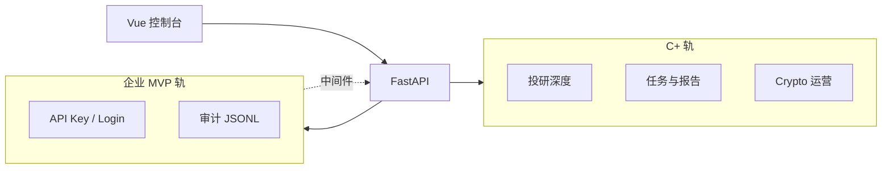

# 双线产品规格 — C+ 专业轨 × 企业 MVP 轨

## 决策（2026-05-30）

用户选择 **方案 3**：两条轨道并行，不互相绑架。

| 轨道 | 受众 | 原则 |
|------|------|------|
| **C+ 专业轨** | 个人 / 小团队 | 本地优先、`data/` 可备份、功能做深投研与运维 |
| **企业 MVP 轨** | 内网 / 小团队部署 | **可选模块**，默认关闭；先 **登录 + API Key + 审计**，不做多租户 |

**不做（企业 MVP 阶段）**：多租户、RBAC 细粒度、计费、Postgres 强依赖、K8s 运营商。

---

## C+ 专业轨 — 路线图

### P0（下一迭代）
- 报告 **版本链** + 与上一版 **diff 摘要**（同 `qlib_code` 多次 `report.json` 归档）
- 任务 **SSE 日志流**（替代纯轮询）；失败 **重试** 与 `max_attempts`
- **选股器**：条件筛选 → 批量入队 `analyze_stock` / `qlib_analyze`

### P1
- **组合视图**：导入持仓 CSV、暴露汇总、跳转已有回测 API
- 告警 **可视化规则编辑器**（调度 custom_rules 不再手写 JSON）
- 钉钉 / 企业微信 Webhook 适配器（除通用 URL）

### P2
- 可选 **PostgreSQL** 仅索引元数据（任务、报告索引、审计）；大文件仍落盘
- 研究 **笔记 / 标签** 挂在报告与自选上

---

## 企业 MVP 轨 — v0.1 范围

### 目标
内网部署时可 **打开开关** 要求 API Key / 登录，并留下 **谁何时调了什么** 的审计 trail。

### 配置（`data/settings.json` → `enterprise` + 环境变量）

| 项 | 默认 | 说明 |
|----|------|------|
| `enabled` | `false` | 总开关 |
| `require_auth` | `false` | `true` 时变更类 API 需认证 |
| `audit_enabled` | `true` | 写 JSONL 审计（可与 require_auth 独立） |
| `api_keys` | `[]` | `[{ "id", "label", "key" }]` — MVP 明文存 settings；生产建议仅 env |

环境变量：
- `QUANT_RD_ENTERPRISE_ENABLED`
- `QUANT_RD_API_KEYS`（逗号分隔，覆盖/补充 keys）
- `QUANT_RD_ADMIN_PASSWORD`（可选，用于 `/enterprise/login` 换短期 token）

### API
- `GET /api/v1/enterprise/status` — 是否启用、是否要求认证（不含密钥）
- `POST /api/v1/enterprise/login` — `{ "password" }` → `{ "token", "expires_in" }`
- `GET /api/v1/enterprise/audit` — 分页查询审计（需认证若 require_auth）
- `GET/POST /api/v1/settings/enterprise` — 与现有 settings 包一致导出

### 审计字段
`ts`, `method`, `path`, `status`, `duration_ms`, `principal`（api_key id 或 `admin`）, `client_ip`, `error`

存储：`data/enterprise/audit.jsonl`

### 兼容 C 轨
- `enterprise.enabled=false`：**行为与今日完全一致**，零迁移。
- 前端：设置页可填 API Key，写入 `localStorage`，axios 自动带 `X-API-Key`。

---

## 架构

---

## 验收（企业 MVP v0.1）

1. 默认部署：无 Header 仍可 `POST /jobs/*`、读报告。
2. `enabled=true` + `require_auth=true`：无 Key 时 `POST` 返回 401；带 Key 成功。
3. `audit_enabled=true`：任意 `/api/v1/*` 调用在 JSONL 可查到。
4. 设置导出包含 `enterprise` 段，换机可恢复。

---

## 批准

- 双线策略：**已确认（用户选 3）**
- 企业 MVP v0.1：**登录 + API Key + 审计** 先行实现
