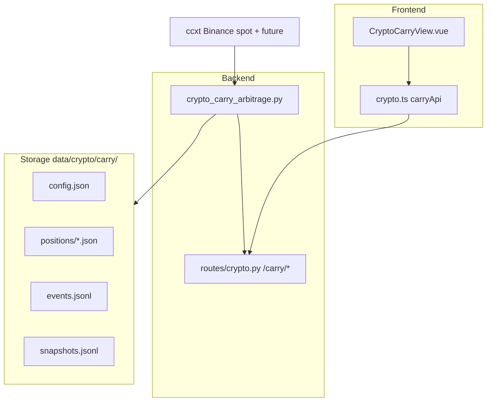

# Crypto Cash & Carry (Paper) — Design Spec

**Approved:** 2026-06-12  
**Scope:** Binance spot + USDT-M perpetual basis/funding scanner with manual paper Carry simulation

## User decisions

| Dimension | Choice |
|-----------|--------|
| Strategy type | Spot–perp Cash & Carry (long spot + short perp) |
| v1 delivery | Paper Carry simulation (no live orders) |
| Symbol scope | Configurable watchlist; default `[BTC, ETH, SOL, BNB]` |
| Entry | Threshold alert + manual open |
| Exit | Exit-threshold alert + manual close |
| Architecture | Independent module (parallel to spot-bot / perp-bot) |
| Exchange | Binance only (spot + USDT-M perp via ccxt) |

## Goals

1. Scan watchlist symbols for **basis** and **funding APR**, rank/highlight opportunities.
2. Let the user **manually open** a delta-neutral paper Carry (long spot + short perp at equal notional).
3. Accrue **funding PnL** on 8h funding boundaries while position is open.
4. Alert when composite yield falls below exit threshold or funding turns negative; user **manually closes**.
5. Persist positions, events, and summary metrics under `data/crypto/carry/`.

## Non-goals (v1)

- Live or semi-auto order execution
- Multi-exchange arbitrage
- Full-market Top-N scan
- Kill Switch execution coupling (v2)
- Auto open/close on threshold (v2 scheduler)
- Portfolio-level capital allocation across multiple open carries beyond one-per-symbol rule

---

## Metrics

For each base symbol `S` (e.g. `BTC`):

| Field | Definition |
|-------|------------|
| `spot_mark` | Binance spot last/mark from `fetch_ticker(S/USDT)` |
| `perp_mark` | Binance USDT-M mark from `fetch_ticker(S/USDT:USDT)` |
| `basis_bps` | `(perp_mark - spot_mark) / spot_mark × 10_000` |
| `funding_rate` | Latest 8h funding rate from `fetch_funding_rate(S/USDT:USDT)` |
| `funding_apr` | `funding_rate × 3 × 365` (three 8h periods per day) |
| `basis_apr_hint` | `basis_bps / 10_000 × 365` — informational; not a guaranteed yield |
| `composite_apr` | `funding_apr + basis_apr_hint` — used for entry/exit alerts |

### Default thresholds (configurable)

| Param | Default |
|-------|---------|
| `entry_threshold_apr` | `0.15` (15%) |
| `exit_threshold_apr` | `0.05` (5%) |
| `default_notional_usdt` | `10_000` |
| `spot_fee_pct` | `0.001` (reuse paper trading default) |
| `perp_fee_pct` | `0.001` |
| `slippage_pct` | `0.0005` |

### Alert rules

- **Entry alert:** `composite_apr >= entry_threshold_apr` and no open paper position for symbol.
- **Exit alert (open position):** `composite_apr <= exit_threshold_apr` **OR** `funding_rate < 0`.

Alerts are **UI-only** in v1 (highlight tags); no auto trade.

---

## Architecture



### Module choice

**Independent `crypto_carry_arbitrage.py`** (not extending `crypto_paper_trading.PaperAccount`):

- Carry is a **paired** delta-neutral position; single-leg `PaperAccount` model is a poor fit.
- Reuse **conventions** from `crypto_paper_trading`: fee defaults, JSON persistence, trade event shape.

### Related existing code

| Module | Reuse |
|--------|-------|
| `ccxt_data.to_ccxt_symbol` | Spot pair naming |
| `binance_perp_bot` | Perp pair pattern `BASE/USDT:USDT` |
| `crypto_paper_trading` | Fee/slippage defaults, ledger patterns |
| `perp_account_analytics` | Reference for funding semantics (live account); paper module simulates funding separately |

---

## Backend: `crypto_carry_arbitrage.py`

### Config

```python
@dataclass
class CarryConfig:
    watchlist: list[str]  # ["BTC", "ETH", "SOL", "BNB"]
    quote: str = "USDT"
    entry_threshold_apr: float = 0.15
    exit_threshold_apr: float = 0.05
    default_notional_usdt: float = 10_000.0
    spot_fee_pct: float = 0.001
    perp_fee_pct: float = 0.001
    slippage_pct: float = 0.0005
    testnet: bool = False
```

Persisted at `data/crypto/carry/config.json`.

### Scan

`scan_watchlist(config, *, now=None) -> list[CarryOpportunity]`

Each opportunity:

```python
{
  "symbol": "BTC",
  "spot_mark": 65000.0,
  "perp_mark": 65050.0,
  "basis_bps": 7.69,
  "funding_rate": 0.0001,
  "funding_apr": 0.1095,
  "basis_apr_hint": 0.0281,
  "composite_apr": 0.1376,
  "entry_alert": true,
  "exit_alert": false,
  "has_open_position": false,
  "ts": "2026-06-12T08:00:00+00:00"
}
```

Optional: append row to `snapshots.jsonl` on each scan.

### Paper position model

One **open** paper Carry per symbol maximum.

```python
@dataclass
class PaperCarryPosition:
    id: str  # uuid
    symbol: str
    quote: str
    notional_usdt: float
    base_amount: float  # notional / spot_entry
    spot_entry: float
    perp_entry: float
    entry_basis_bps: float
    entry_ts: str
    status: Literal["open", "closed"]
    accrued_funding: float = 0.0
    total_fees: float = 0.0
    last_funding_ts: str | None = None  # last applied funding event time
    closed_ts: str | None = None
    realized_pnl: float | None = None
```

Stored at `data/crypto/carry/positions/{id}.json`.

### Open / close

- `open_paper_carry(symbol, notional_usdt | None, config)`  
  - Reject if open position exists for symbol.  
  - Apply slippage: spot buy at `spot_mark × (1 + slippage)`, perp short at `perp_mark × (1 - slippage)`.  
  - Charge open fees on both legs.  
  - Append `open` event to `events.jsonl`.

- `close_paper_carry(position_id, config, *, spot_mark, perp_mark, funding_rate)`  
  - Close spot + perp at marks with slippage/fees.  
  - Realized PnL = accrued funding + basis PnL − total fees.  
  - Basis PnL approx: `(entry_basis - exit_basis) × notional_usdt / 10_000` where basis in bps.  
  - Append `close` event.

### Funding accrual

`accrue_open_positions(config, *, now=None)` — called on scan or dedicated endpoint:

- For each open position, if `now >= next_funding_boundary` since `last_funding_ts` (or entry):
  - `funding_pnl = notional_usdt × funding_rate` (short receives positive funding)
  - Increment `accrued_funding`
  - Append `accrue` event

Funding boundary: align to Binance 8h UTC schedule (00:00, 08:00, 16:00) or use `nextFundingTime` from ccxt when available.

### Summary

`carry_summary(config) -> dict`:

- Open count, total accrued funding, total realized PnL (closed), alert counts, recent events tail.

---

## API (`routes/crypto.py`)

Prefix: `/crypto/carry/` (mounted under existing `/api/v1` crypto router).

| Method | Path | Description |
|--------|------|-------------|
| GET | `/crypto/carry/scan` | Scan watchlist; lazy accrue; return opportunities + open positions |
| GET | `/crypto/carry/config` | Read config |
| PUT | `/crypto/carry/config` | Update watchlist, thresholds, notional, fees |
| GET | `/crypto/carry/positions` | List open + recent closed positions |
| POST | `/crypto/carry/positions/open` | Body: `{ symbol, notional_usdt? }` |
| POST | `/crypto/carry/positions/{id}/close` | Close paper position |
| GET | `/crypto/carry/summary` | Aggregate stats + recent events |
| GET | `/crypto/carry/events` | Paginated events from `events.jsonl` |

Errors:

- `400` — symbol not in watchlist, already has open position, invalid notional
- `404` — position id not found
- `503` — exchange fetch failure (structured detail)

---

## Frontend

### Route & nav

- Path: `/crypto-carry`
- Name: `crypto-carry`
- Nav label: **Carry 套利** (Crypto section, near Spot/Perp Bot)
- View: `src/quant_trade_tool/src/views/CryptoCarryView.vue`
- API: `src/quant_trade_tool/src/api/crypto.ts` — `carryScan`, `carryConfig`, `carryOpen`, `carryClose`, `carrySummary`

### UI sections

1. **Config bar** — watchlist editor (tags), entry/exit APR sliders, default notional, Refresh scan button
2. **Opportunity table** — symbol, basis bps, funding rate, funding APR, composite APR, alert tag, Open button (disabled if alert false or position open)
3. **Open positions** — entry time, notional, entry basis, accrued funding, unrealized hint, exit alert tag, Close button
4. **Summary strip** — open count, total realized, total accrued, last scan time

Style: Element Plus tables/tags consistent with `SpotBotView` / `CryptoOpsView`.

---

## Storage layout

```
data/crypto/carry/
  config.json
  events.jsonl
  snapshots.jsonl          # optional, scan history
  positions/
    {uuid}.json
```

Runtime data; **not committed** to git (same as other `data/crypto/*` artifacts).

---

## Testing

| File | Coverage |
|------|----------|
| `tests/test_crypto_carry_arbitrage.py` | Metrics math, threshold alerts, open/close PnL, funding accrual boundaries, one-position-per-symbol |
| `tests/test_crypto_carry_routes.py` | FastAPI route smoke with mocked scan/open/close |

No live exchange calls in unit tests — mock ccxt fetch functions.

---

## v2 roadmap (out of scope)

- Scheduler step / auto paper open-close on threshold
- Semi-auto live execution with Kill Switch gate
- Full-market scanner
- Multi-exchange basis
- Attach carry digest to `crypto-workflow` advice synthesis
