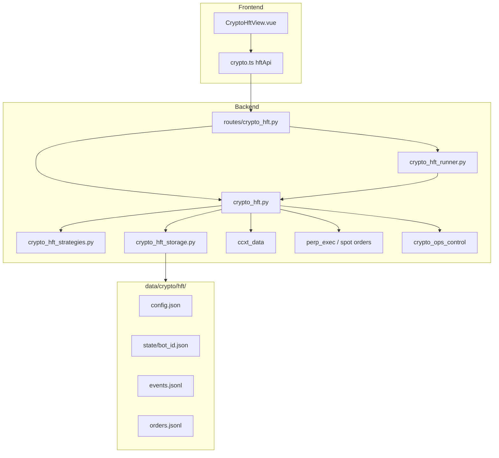
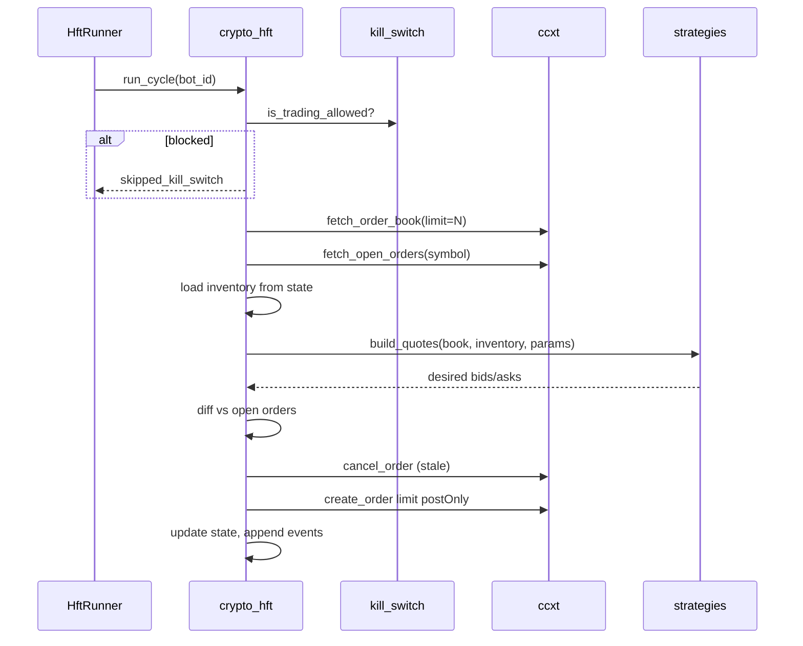

# Crypto Market Making (HFT v1) — Design Spec

**Approved:** 2026-06-12 (architecture confirmed)  
**Scope:** Live limit-order market making for Binance spot + USDT-M perp via REST polling (秒级), default Testnet

## User decisions

| Dimension | Choice |
|-----------|--------|
| Goal | **Live market making** — limit/post-only, inventory skew, cancel-replace |
| Markets | **Spot + USDT-M perpetual** |
| Strategies | **Classic bilateral MM + grid MM** (UI-selectable templates) |
| Environment | **Testnet default**; mainnet requires explicit opt-in |
| Integration | **Standalone module** parallel to carry / spot bot |
| Implementation path | **REST polling v1** (1–2s loop); WebSocket upgrade path reserved for v2 |

## Non-goals (v1)

- Sub-millisecond / colocated HFT
- Multi-exchange routing
- Options market making
- Tick-level backtest engine (bar/tape replay deferred)
- Auto-hedge spot↔perp inventory across markets in one bot instance (one `market_type` per runner)

---

## Goals

1. Run a **market-making bot** on Binance (testnet by default) for a single symbol + market type (spot or perp).
2. Poll L2 order book, compute quotes via **classic_mm** or **grid_mm**, reconcile open limit orders (cancel-replace).
3. Track **inventory**, realized/unrealized PnL estimate, spread capture, and order events.
4. Expose **API + Vue page** for config, start/stop, status, order book snapshot, and event log.
5. Honor global **kill switch** (`crypto_ops_control`) — halt quoting and optionally flatten.

## Terminology

v1 is **秒级 REST 做市**, not institutional HFT. UI label: 「做市 / HFT」with subtitle clarifying REST polling interval.

---

## Architecture



### Module layout

| File | Responsibility |
|------|----------------|
| `crypto_hft_strategies.py` | Strategy registry: `classic_mm`, `grid_mm`; param schemas; `build_quotes(book, inventory, params) -> list[Quote]` |
| `crypto_hft.py` | Book fetch, quote diff vs open orders, place/cancel, inventory & PnL, `run_cycle()` |
| `crypto_hft_storage.py` | `HftConfig`, load/save config, per-bot state, append events/orders |
| `crypto_hft_runner.py` | Thread per active bot, `interval_ms`, start/stop/status (mirror `crypto_bot_scheduler` but dedicated) |
| `routes/crypto_hft.py` | REST under `/api/v1/crypto/hft/*` |
| `CryptoHftView.vue` | Config form, book display, open orders, inventory, PnL cards, event table |

### Reuse

| Module | Reuse |
|--------|-------|
| `ccxt_data.create_exchange` | Exchange client, testnet, market_type |
| `perp_exec` / `binance_bot` patterns | Limit order placement, min notional checks |
| `crypto_ops_control` | Global kill switch gate before each cycle |
| `crypto_carry_arbitrage` | Config/state/events JSON layout pattern |
| `perp_telemetry.append_jsonl` | Optional shared JSONL helper |

---

## Data flow (one cycle)



1. **Fetch** top-of-book (default 5 levels) + open orders + balance/position.
2. **Strategy** outputs target price/size per level (max `levels` per side, default 1 for classic, N for grid).
3. **Reconcile**: cancel orders outside tolerance (`price_tolerance_bps`); place missing; skip if within tolerance.
4. **Persist** state + JSONL event (`quote_refresh`, `order_placed`, `order_canceled`, `fill_detected`, `error`).

---

## Strategies

### `classic_mm` — 双边做市（库存偏斜）

| Param | Default | Description |
|-------|---------|-------------|
| `half_spread_bps` | 8 | Half-spread from mid |
| `order_size_usdt` | 50 | Per-side notional |
| `levels` | 1 | Single level per side in v1 |
| `inventory_skew_bps` | 4 | Shift quotes per unit inventory |
| `max_inventory_usdt` | 500 | Stop quoting side that increases exposure |
| `min_spread_bps` | 4 | Floor on spread after skew |

Logic: `mid = (best_bid + best_ask) / 2`; skew bid/ask down when long inventory; pause bid if inventory ≥ max.

### `grid_mm` — 网格做市

| Param | Default | Description |
|-------|---------|-------------|
| `grid_spacing_bps` | 15 | Distance between levels |
| `grid_levels` | 5 | Levels per side |
| `order_size_usdt` | 30 | Per grid order |
| `center_price` | auto | Mid at start; optional manual anchor |
| `max_inventory_usdt` | 1000 | Cap total exposure |

Logic: ladder of bids below center, asks above center; optional re-center when mid drifts > `reanchor_bps`.

Both strategies return `Quote(side, price, amount, client_order_id_prefix)`.

---

## Configuration (`HftConfig`)

```json
{
  "bot_id": "btc-perp-mm",
  "symbol": "BTC",
  "quote": "USDT",
  "market_type": "future",
  "strategy_id": "classic_mm",
  "strategy_params": { "half_spread_bps": 8, "order_size_usdt": 50 },
  "testnet": true,
  "interval_ms": 1500,
  "book_depth": 5,
  "price_tolerance_bps": 3,
  "post_only": true,
  "enabled": false
}
```

Per-bot state (`data/crypto/hft/state/{bot_id}.json`):

- `inventory_base`, `inventory_usdt`, `avg_entry_price`
- `open_order_ids`, `last_mid`, `last_cycle_at`
- `realized_pnl_usdt`, `session_started_at`
- `status`: `stopped` | `running` | `error`

---

## Risk controls

| Control | Behavior |
|---------|----------|
| Kill switch | If `crypto_ops_control` blocks trading → skip cycle, log event, optional cancel-all |
| `max_inventory_usdt` | Strategy stops quoting increasing side |
| `max_order_size_usdt` | Hard cap per order |
| `max_daily_loss_usdt` | Stop bot if session realized+unrealized < -limit |
| `max_open_orders` | Default 20 (grid) |
| Testnet default | `testnet: true` unless config + UI confirm mainnet |
| Mainnet guard | API requires `confirm_mainnet: true` on start |
| Rate limit | Respect ccxt `enableRateLimit`; min `interval_ms` 1000 |

On unrecoverable exchange error: set `status=error`, stop runner thread, surface `last_error` in API.

---

## API (`/api/v1/crypto/hft`)

| Method | Path | Description |
|--------|------|-------------|
| GET | `/strategies` | List strategy templates + param schemas |
| GET | `/config` | Global defaults + registered bots summary |
| PUT | `/config` | Update global defaults (watchlist, testnet default) |
| GET | `/bots` | List bots with status |
| POST | `/bots` | Register/update bot config |
| DELETE | `/bots/{bot_id}` | Remove bot (must be stopped) |
| POST | `/bots/{bot_id}/start` | Start runner (`confirm_mainnet` optional) |
| POST | `/bots/{bot_id}/stop` | Stop runner; `cancel_orders` query param |
| POST | `/bots/{bot_id}/cycle` | Manual single cycle (debug) |
| GET | `/bots/{bot_id}/status` | State + open orders + book snapshot |
| GET | `/bots/{bot_id}/events` | Tail `events.jsonl` |
| GET | `/book` | One-off book snapshot (`symbol`, `market_type`) |

Router: `routes/crypto_hft.py`, included in `routes/__init__.py` with prefix `/crypto/hft`.

---

## Frontend (`CryptoHftView.vue`)

Route: `/crypto-hft`  
Nav: 数字货币管理 → 「做市 / HFT」

**Sections:**

1. **Bot 配置** — symbol, market_type (spot/perp), strategy, params, testnet toggle, interval
2. **盘口 & 报价** — best bid/ask, mid, spread bps, target quotes vs live orders
3. **库存 & 盈亏** — inventory, realized/unrealized, session PnL
4. **挂单列表** — open limits with cancel button (calls stop with cancel or dedicated endpoint)
5. **事件流** — recent JSONL events, auto-refresh
6. **启停** — Start / Stop; mainnet confirmation modal

---

## Storage layout

```
data/crypto/hft/
  config.json           # global defaults
  bots.json             # registry index
  state/{bot_id}.json
  events/{bot_id}.jsonl
  orders/{bot_id}.jsonl
```

---

## Error handling

| Case | HTTP / behavior |
|------|-----------------|
| Unknown `strategy_id` | 400 |
| Bot already running | 409 |
| Kill switch active | 403 on start; cycle skipped when running |
| Exchange / ccxt error | 503; bot → error state |
| Below min notional | Skip order, log warning event |
| Invalid `bot_id` | 404 |

---

## Testing

| Layer | Cases |
|-------|-------|
| `crypto_hft_strategies` | Quote generation; inventory skew; grid spacing; max inventory |
| `crypto_hft` | Reconcile diff (mock open orders); kill switch skip; min notional skip |
| `crypto_hft_runner` | Start/stop; single cycle mock |
| `routes/crypto_hft` | strategies 200; register/start/stop mock |
| Integration | Optional testnet smoke (skipped in CI) |

Fixtures: synthetic order book dicts in `tests/fixtures/hft_book.json`.

---

## v2 upgrade path (not in v1)

- WebSocket `watch_order_book` + user data stream
- `ccxt.pro` or native Binance WS client
- Latency metrics (`cycle_ms`, `exchange_rtt_ms`)
- Spot↔perp hedged MM in one coordinator
- Tape-based sim backtest

---

## Success criteria (v1)

1. User registers a BTC perp bot on **testnet**, starts classic_mm, sees limit orders on book within 3s.
2. Inventory updates after fills (via open-order diff or fetch_my_trades poll).
3. Stop + cancel_orders clears all bot limits.
4. Kill switch prevents new orders.
5. Grid and classic strategies switchable from UI without code change.
6. Existing spot/perp/carry modules unchanged.

---

## Security

- API keys via existing env / settings pattern (never stored in `config.json`).
- `bot_id` alphanumeric + hyphen only; path traversal blocked.
- Mainnet requires explicit confirmation flag.
