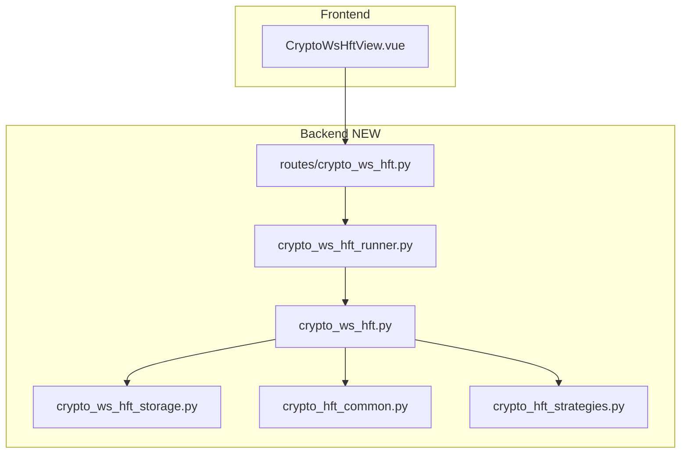

# Crypto WebSocket Market Making — Design Spec

**Approved:** 2026-06-12  
**Scope:** Event-driven Binance spot + USDT-M perp market making via ccxt.pro WebSocket; independent from REST polling HFT

## User decisions

| Dimension | Choice |
|-----------|--------|
| Transport | **ccxt.pro** (`watch_order_book`, async orders) |
| Runtime | **asyncio** event loop |
| Markets | **Spot + USDT-M perpetual** |
| Trigger | **UI selectable**: every depth update OR throttle (ms) |
| Default mode | **Observe-only (dry_run)**; live requires explicit confirm |
| REST HFT | **No modifications** to existing秒级 REST module |
| Shared logic | **New** `crypto_hft_common.py`; strategies unchanged |

## Non-goals

- Colocated microsecond HFT (Python + ccxt.pro is ms-scale event-driven MM)
- Modifying `crypto_hft.py`, `crypto_hft_runner.py`, REST routes, or `CryptoHftView.vue`
- Multi-exchange routing

## Architecture

## Module layout

| File | Responsibility |
|------|----------------|
| `crypto_hft_common.py` | `resolve_ccxt_symbol`, `summarize_book`, `plan_reconcile`, `ReconcilePlan` |
| `crypto_ws_hft_storage.py` | Config/state/events under `data/crypto/ws_hft/` |
| `crypto_ws_hft.py` | Async engine: pro exchange, book handler, reconcile, latency |
| `crypto_ws_hft_runner.py` | `WsHftRunnerManager` asyncio tasks |
| `routes/crypto_ws_hft.py` | `/api/v1/crypto/ws-hft/*` |

## Config (WsHftBotConfig)

Extends REST HFT fields minus `interval_ms`; adds:

- `trigger_mode`: `"every_update"` | `"throttle"`
- `throttle_ms`: default 20 (1–500)
- `dry_run`: default **true**

## Live / safety gates

1. Global kill switch (`crypto_ops_control`)
2. `dry_run=true` → log hypothetical place/cancel only
3. `dry_run=false` + start → requires `confirm_live=true`
4. Mainnet → requires `confirm_mainnet=true`

## Latency metrics

- `book_recv_ns` → `action_done_ns` in microseconds
- Rolling p50/p95 in bot state (last 100 samples)
- `book_updates_total`, `reconciles_total`, `throttled_skips`

## API

- `GET /strategies` — reuse strategy registry
- `GET/PUT /config` — global defaults
- `POST /bots`, `DELETE /bots/{id}`
- `GET /bots`, `GET /bots/{id}/status`
- `POST /bots/{id}/start` — `confirm_live`, `confirm_mainnet`
- `POST /bots/{id}/stop` — `cancel_orders`
- `GET /bots/{id}/events`

## Frontend

- Route `/crypto-ws-hft`, nav「WS 做市」
- Subtitle: WebSocket 事件驱动做市（毫秒级，非 colo μs）
- Controls: trigger mode, throttle ms, dry_run, strategy, latency panel

## Tests

- `test_crypto_hft_common.py` — reconcile parity
- `test_crypto_ws_hft.py` — throttle, dry_run plan, latency stats
- `test_crypto_ws_hft_routes.py` — register, start gates
