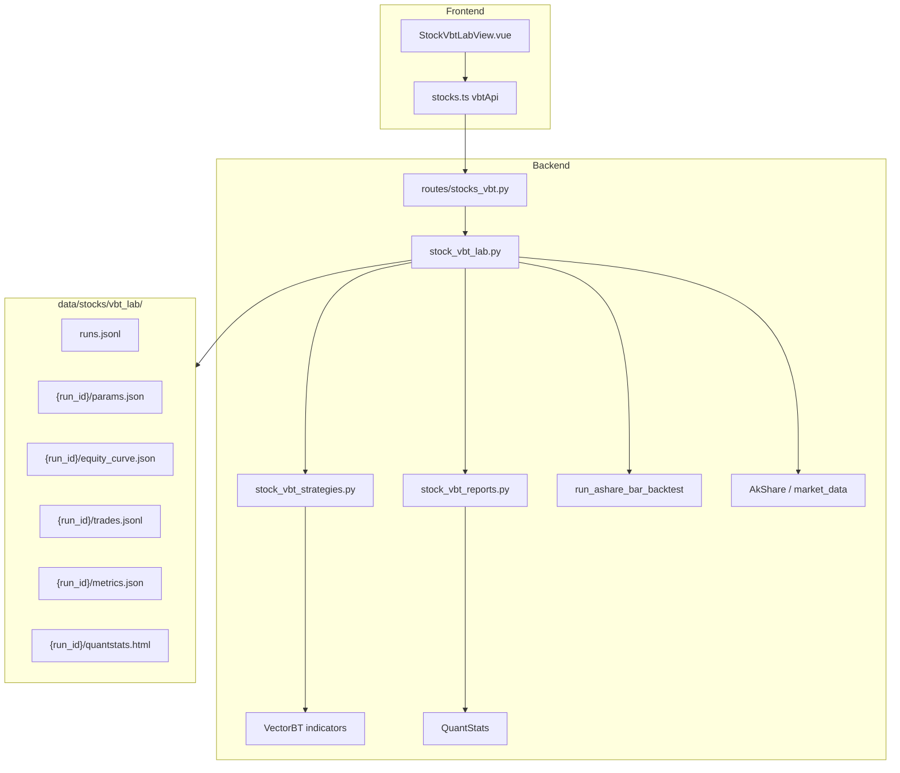

# A-Share VectorBT Lab — Design Spec

**Approved:** 2026-06-22  
**Scope:** Independent A-share quant research module — Phase 1: AkShare + VectorBT + QuantStats single-stock backtest with full A-share execution rules

## User decisions

| Dimension | Choice |
|-----------|--------|
| Architecture | **New independent module** (parallel to Stock Zipline Lab / Crypto Carry) |
| Phase 1 unit | **Single-stock** backtest + QuantStats report |
| Execution model | **Full A-share rules** — T+1, limit up/down, commission/stamp/transfer (reuse `stock_ashare_pandas`) |
| Phase 1 strategies | **4 templates** — SMA cross, RSI, MACD cross, Bollinger breakout |
| VectorBT integration | **Signal adapter** — VectorBT indicators/signals → `target` column → `run_ashare_bar_backtest` → QuantStats |

## Five-phase roadmap

| Phase | Stack | Deliverable | Status |
|-------|-------|-------------|--------|
| **1** | AkShare + VectorBT + QuantStats | Single-stock backtest lab + tear sheet | **This spec** |
| **2** | Optuna | Auto hyperparameter tuning per strategy + OOS validation | Future |
| **3** | LightGBM / XGBoost | Cross-sectional stock scoring / Top-K selection | Future |
| **4** | PyPortfolioOpt | Portfolio weight optimization on selected universe | Future |
| **5** | APScheduler | Daily retrain + signal deployment pipeline | Future |

Phases 2–5 are defined here for boundary clarity; **only Phase 1 is in scope for the first implementation plan.**

---

## Goals (Phase 1)

1. Let the user pick an A-share symbol, date range, strategy template, and parameters.
2. Fetch daily OHLCV via **AkShare** (with local cache under `data/stocks/{code}/`).
3. Generate entry/exit signals with **VectorBT** indicators.
4. Simulate fills with **full A-share execution rules** via existing `run_ashare_bar_backtest`.
5. Produce **QuantStats** HTML tear sheet + JSON metrics; persist run artifacts under `data/stocks/vbt_lab/`.
6. Expose API + Vue page **independent** of Stock Zipline Lab.

## Non-goals (Phase 1)

- Universe / watchlist batch ranking (Phase 1b or Phase 3)
- Optuna, ML models, PyPortfolioOpt, scheduled jobs
- Live or paper order routing to broker
- Replacing or refactoring Stock Zipline Lab
- Intraday / minute bars (daily only in v1)
- Partial position sizing beyond 0/1 target (full in / full out)

---

## Architecture



### Module layout

| File | Responsibility |
|------|----------------|
| `stock_vbt_lab.py` | Orchestration: load data, run backtest, persist run, list runs |
| `stock_vbt_strategies.py` | Strategy registry + VectorBT signal generation → `target` series |
| `stock_vbt_reports.py` | Equity → QuantStats HTML + metrics JSON |
| `routes/stocks_vbt.py` | FastAPI routes under `/api/v1/stocks/vbt/*` |
| `StockVbtLabView.vue` | UI: form, metrics cards, equity chart, report link |
| `stocks.ts` | TypeScript types + API client |

### Related existing code

| Module | Reuse |
|--------|-------|
| `market_data.fetch_stock_daily` | AkShare daily OHLCV |
| `akshare_data.to_qlib_code` | Symbol normalization |
| `stock_ashare_pandas.run_ashare_bar_backtest` | T+1, limits, fees, trades |
| `stock_ashare_execution.AShareFeeSchedule` | Fee defaults |
| `crypto_zipline_pandas._metrics` | Overlap metrics if useful |
| Jobs API pattern (`POST /api/v1/jobs/*`) | Optional async long backtests |

### VectorBT integration pattern (signal adapter)

VectorBT is used for **indicator computation and signal logic only**, not for portfolio simulation:

1. Input: `DataFrame` with columns `open, high, low, close, volume` (datetime index).
2. Strategy runner returns boolean/int series `entries`, `exits` (or direct `target`).
3. Convert to `target` column: `0` = flat, `1` = long (Phase 1 long-only).
4. Call `run_ashare_bar_backtest(df, target_col="target", capital_base=..., symbol=..., use_ashare via context)`.
5. Output: `equity_curve`, `trades`, `metrics`, `execution_stats`.

This keeps A-share semantics identical to Zipline pandas path per [ashare-transaction-model spec](2026-06-15-ashare-transaction-model-design.md).

---

## Strategies (Phase 1)

| `strategy_id` | Name | Logic | Default params |
|---------------|------|-------|----------------|
| `sma_cross` | 双均线交叉 | Long when fast SMA crosses above slow; flat on cross below | `fast=10, slow=30` |
| `rsi_revert` | RSI 超买超卖 | Long when RSI &lt; oversold; flat when RSI &gt; overbought | `period=14, oversold=30, overbought=70` |
| `macd_cross` | MACD 金叉 | Long on MACD line cross above signal; flat on cross below | `fast=12, slow=26, signal=9` |
| `bb_breakout` | 布林带突破 | Long on close above upper band; flat on close below lower band | `period=20, std=2.0` |

Each strategy exposes:

- `min_bars` — warmup rows required
- `param_schema` — name, type, min, max, default for UI
- `build_signals(df, params) -> pd.DataFrame` with `target` column

Long-only in v1; short selling not supported for A-shares.

---

## Data

### Input

- **Provider:** AkShare via `market_data.fetch_stock_daily(symbol, start_date, end_date, adjust="qfq")`
- **Cache:** Prefer `data/stocks/{QLIB_CODE}/ohlcv.csv` if fresh enough; refresh on user `refresh=true` or missing range
- **Frequency:** Daily (`1d`)

### Output per run (`data/stocks/vbt_lab/{run_id}/`)

| File | Content |
|------|---------|
| `params.json` | symbol, dates, strategy_id, params, capital_base, created_at |
| `equity_curve.json` | `[{ts, equity, cash, position_value}]` |
| `trades.jsonl` | One JSON object per fill |
| `metrics.json` | QuantStats summary + custom execution_stats |
| `quantstats.html` | Full tear sheet (self-contained or asset-linked) |
| `runs.jsonl` (parent) | Index line: run_id, symbol, strategy, summary metrics |

---

## API (Phase 1)

Prefix: `/api/v1/stocks/vbt`

| Method | Path | Description |
|--------|------|-------------|
| GET | `/strategies` | List strategies + param schemas + defaults |
| POST | `/backtest` | Sync backtest; body: symbol, start, end, strategy_id, params, capital_base, refresh? |
| GET | `/runs` | List recent runs (limit, optional symbol filter) |
| GET | `/runs/{run_id}` | Full result metadata + metrics |
| GET | `/runs/{run_id}/equity` | Equity curve JSON |
| GET | `/runs/{run_id}/trades` | Trades list |
| GET | `/runs/{run_id}/report` | QuantStats HTML (`text/html`) |

Optional (reuse jobs):

| Method | Path | Description |
|--------|------|-------------|
| POST | `/jobs/vbt-backtest` | Async job; same body as sync backtest |

### Request body (backtest)

```json
{
  "symbol": "600519",
  "start": "2020-01-01",
  "end": "2025-12-31",
  "strategy_id": "sma_cross",
  "strategy_params": { "fast": 10, "slow": 30 },
  "capital_base": 100000,
  "refresh_data": false
}
```

### Response (backtest)

```json
{
  "run_id": "uuid",
  "symbol": "SH600519",
  "strategy_id": "sma_cross",
  "metrics": {
    "total_return": 0.42,
    "sharpe": 1.1,
    "max_drawdown": -0.18,
    "win_rate": 0.55,
    "cagr": 0.08
  },
  "execution_stats": { "t_plus_one_blocks": 12, "limit_blocks": 3 },
  "report_url": "/api/v1/stocks/vbt/runs/{run_id}/report"
}
```

---

## Frontend (Phase 1)

- **Route:** `/stock-vbt`
- **Nav label:** `A股 VectorBT 实验室`
- **Sections:**
  1. Form — symbol (with link from A-stock detail), date range, strategy select, dynamic params
  2. Run button — calls sync backtest or job API
  3. Metrics row — total return, CAGR, Sharpe, max DD, win rate
  4. Equity curve chart (reuse `EquityCurveChart` component)
  5. Trades table
  6. Button — open QuantStats HTML report in new tab
  7. Recent runs list

---

## Dependencies

Add to `pyproject.toml`:

```toml
"vectorbt>=0.26.0",
"quantstats>=0.0.62",
```

Phase 2+ (not in Phase 1 install):

```toml
"optuna>=3.0.0",
"pyportfolioopt>=1.5.0",
# APScheduler — evaluate reuse of existing scheduler patterns
```

Optional dependency group `vbt` if package size is a concern:

```toml
[project.optional-dependencies]
vbt = ["vectorbt>=0.26.0", "quantstats>=0.0.62"]
```

---

## Error handling

| Case | Behavior |
|------|----------|
| Unknown strategy_id | 400 |
| Insufficient bars (&lt; min_bars) | 400 with required count |
| AkShare fetch failure | 503 with message; suggest cached CSV |
| VectorBT / QuantStats import missing | 503 install hint |
| Invalid date range | 400 |

---

## Testing

| Layer | Cases |
|-------|-------|
| `stock_vbt_strategies` | Each strategy produces valid `target`; param validation; warmup |
| `stock_vbt_lab` | End-to-end on fixture OHLCV; metrics keys present; run persisted |
| `stock_vbt_reports` | QuantStats HTML generated; metrics JSON schema |
| `routes/stocks_vbt` | strategies 200; backtest mock; runs list |
| A-share rules | T+1: sell signal same day as buy does not reduce position until next day |

Fixtures: `tests/fixtures/ashare_daily_sample.csv` or reuse existing stock test data.

---

## Phase 2–5 boundaries (future specs)

### Phase 2 — Optuna

- Module: `stock_vbt_optuna.py`
- UI tab: "自动调参" on same page
- Walk-forward or train/test split; store `best_params.json` per run
- Does not replace Phase 1 manual backtest

### Phase 3 — LightGBM / XGBoost

- Module: `stock_vbt_ml.py`
- Reuse qlib Alpha158 or lightweight feature set from `backtest_engine`
- Output: daily scores → Top-K candidates
- Extends lab from single symbol to universe

### Phase 4 — PyPortfolioOpt

- Module: `stock_vbt_portfolio.py`
- Input: expected returns / covariance from ML scores or historical returns
- Output: weights → combined portfolio backtest

### Phase 5 — APScheduler daily pipeline

- Module: `stock_vbt_scheduler.py`
- Cron: after market close — refresh data → tune/train → write `data/stocks/vbt_lab/signals/latest.json`
- Admin UI: schedule config, last run status, manual trigger
- Pattern: similar to `crypto_bot_scheduler` but for research signals, not live orders

---

## Security & ops

- No broker credentials
- Runs are local filesystem only
- HTML report served from API — sanitize paths (run_id UUID only)
- Rate-limit AkShare refresh (reuse existing retry/backoff in `akshare_data`)

---

## Success criteria (Phase 1)

1. User can backtest `600519` with `sma_cross` and see QuantStats metrics within 30s (3y daily).
2. Trades respect T+1 and limit rules (verified by unit test).
3. Report HTML opens and shows standard QuantStats sections.
4. Run artifacts persist and appear in recent runs list.
5. Stock Zipline Lab unchanged and still works.
