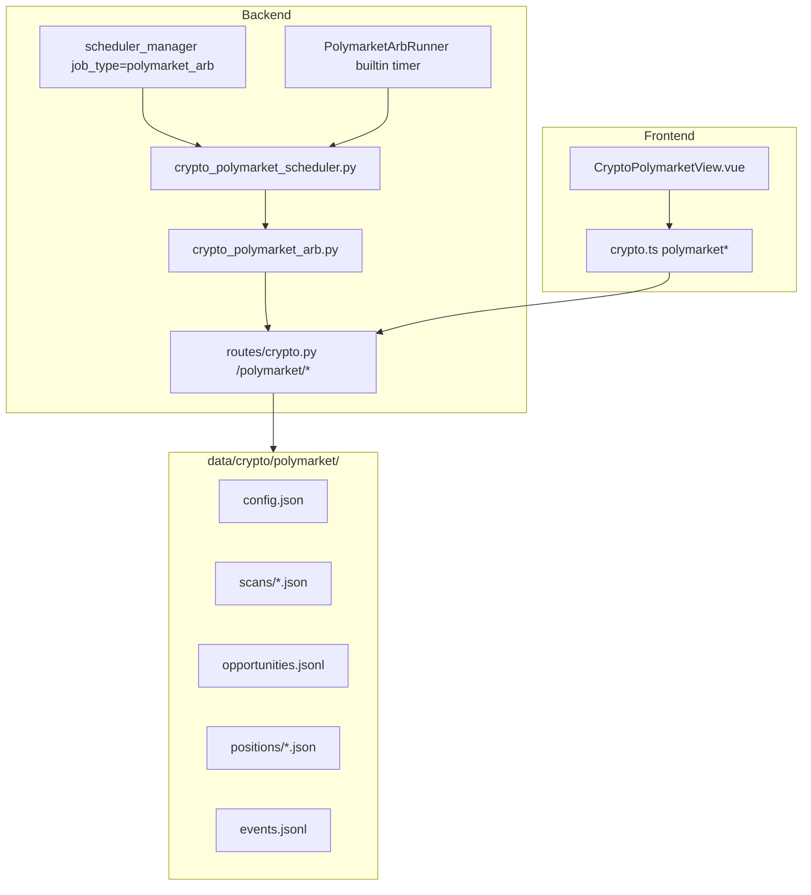

# Polymarket Binary Arbitrage (Paper) — Design Spec

**Approved:** 2026-06-23  
**Scope:** Scheduled scanner for YES+NO ask-sum arbitrage on Polymarket; paper simulation only in v1

## User decisions

| Dimension | Choice |
|-----------|--------|
| Arbitrage type | Binary intra-market: `ask_yes + ask_no < 1` after fees |
| v1 delivery | Scan + alerts + paper positions; no live CLOB orders |
| Scheduling | **Dual channel:** module built-in timer + `/schedules` job type |
| Market universe | Top N by volume (default 50) **merged** with manual watchlist |
| API approach | Pure HTTP: Gamma (discovery) + CLOB REST (order books, public reads) |

## Goals

1. Periodically scan active Polymarket binary markets and rank fee-adjusted arbitrage edges.
2. Surface opportunities in a dedicated crypto UI with configurable thresholds.
3. Allow **paper open/close** on a selected opportunity (locked YES/NO prices + size).
4. Persist scans, opportunities, positions, and events under `data/crypto/polymarket/`.
5. Fire alerts (UI highlight + optional Bark/Webhook via existing alert infra) when edge exceeds threshold.
6. Integrate with global **Schedules** (`job_type=polymarket_arb`) and optional **built-in** interval on server boot.

## Non-goals (v1)

- Live order placement (EIP-712, wallet, `py-clob-client`)
- Cross-venue arbitrage (Kalshi, Manifold, etc.)
- Multi-outcome (N>2) market sum arbitrage
- WebSocket order book streaming
- Auto open/close on threshold (v2)

---

## Metrics

For each binary market with token IDs `yes_token`, `no_token`:

| Field | Definition |
|-------|------------|
| `ask_yes` | Best ask on YES token (price to buy YES) |
| `ask_no` | Best ask on NO token (price to buy NO) |
| `ask_yes_size` | Size at best YES ask |
| `ask_no_size` | Size at best NO ask |
| `raw_edge` | `1.0 - ask_yes - ask_no` |
| `fee_yes` | `ask_yes * taker_fee_bps / 10_000` (per share) |
| `fee_no` | `ask_no * taker_fee_bps / 10_000` |
| `edge` | `raw_edge - fee_yes - fee_no` |
| `edge_bps` | `edge * 10_000` |
| `size_cap` | `min(ask_yes_size, ask_no_size)` |
| `profit_usd` | `edge * size_cap` (upper bound if both legs fill at top of book) |
| `liquidity_usd` | `ask_yes * ask_yes_size + ask_no * ask_no_size` |

### Default config

| Param | Default |
|-------|---------|
| `top_n_volume` | `50` |
| `watchlist_condition_ids` | `[]` |
| `min_edge_bps` | `30` |
| `taker_fee_bps` | `200` (2% per leg; conservative) |
| `min_size_shares` | `10` |
| `min_liquidity_usd` | `100` |
| `builtin_scan_enabled` | `false` |
| `builtin_interval_sec` | `300` |
| `scan_dedupe_sec` | `30` |
| `default_paper_size_shares` | `100` |

### Alert rules

- **Opportunity alert:** `edge_bps >= min_edge_bps` AND `size_cap >= min_size_shares` AND `liquidity_usd >= min_liquidity_usd`
- Cooldown per `condition_id` (default 15 min) before repeat webhook/Bark
- UI always shows latest scan; alerts deduped in notification layer

---

## External APIs

| API | Base | Auth | Usage |
|-----|------|------|-------|
| Gamma | `https://gamma-api.polymarket.com` | None | List events/markets, volume, `conditionId`, outcomes |
| CLOB | `https://clob.polymarket.com` | None for reads | `GET /book?token_id=` best bid/ask |

**Market selection:**

1. `GET /markets?active=true&closed=false&limit={top_n}&order=volume24hr` (or equivalent Gamma endpoint)
2. Union with `watchlist_condition_ids`
3. Filter: exactly two outcomes (binary), both tokens have order books

**Rate limiting:** sequential book fetches with small delay (e.g. 50ms); exponential backoff on 429; cache market list 60s.

---

## Architecture

### Module responsibilities

| Unit | Responsibility |
|------|----------------|
| `crypto_polymarket_arb.py` | Gamma/CLOB HTTP client, scan, metrics, paper positions, persistence |
| `crypto_polymarket_scheduler.py` | `run_polymarket_scan_cycle()` → scan + save + alerts |
| `PolymarketArbRunner` | In-process thread; start/stop via API; `boot_*` on app lifespan |
| `scheduler_manager` | New `polymarket_arb` job type calling same cycle function |
| `schedule_alerts` (optional hook) | Custom rule on `last_cycle_summary.opportunities_count` |

---

## Paper position lifecycle

1. User selects opportunity from latest scan → **preview** (locked prices, edge, est. profit, fees).
2. **Open paper:** create `positions/{uuid}.json` with `status=open`, entry prices, size, `opened_at`.
3. **Close paper:** user marks settled; PnL = `size * (1.0 - ask_yes - ask_no) - fees` (or manual override).
4. One open paper position per `condition_id` (same rule as carry one-per-symbol).

---

## HTTP API

| Method | Path | Description |
|--------|------|-------------|
| GET | `/crypto/polymarket/scan` | Immediate scan; optional `?force=true` bypass dedupe |
| GET | `/crypto/polymarket/scan/latest` | Last persisted scan snapshot |
| GET/PUT | `/crypto/polymarket/config` | Module config |
| GET | `/crypto/polymarket/summary` | Aggregates: last scan time, hit count, open positions |
| GET | `/crypto/polymarket/opportunities` | Tail `opportunities.jsonl` |
| GET | `/crypto/polymarket/positions` | List paper positions |
| POST | `/crypto/polymarket/positions/open` | Open paper from opportunity |
| POST | `/crypto/polymarket/positions/{id}/close` | Close paper |
| GET | `/crypto/polymarket/events` | Tail events |
| POST | `/crypto/polymarket/builtin/start` | Start built-in timer |
| POST | `/crypto/polymarket/builtin/stop` | Stop built-in timer |
| GET | `/crypto/polymarket/builtin/status` | Built-in runner status |

Schedules: existing `/crypto/schedules` CRUD with `job_type=polymarket_arb`, `symbols` unused (empty OK).

---

## Dual-channel scheduling

| Channel | Trigger | Config |
|---------|---------|--------|
| Built-in | `PolymarketArbRunner` thread | `config.builtin_scan_enabled`, `builtin_interval_sec` |
| Schedules | `scheduler_manager` | `job_type=polymarket_arb`, `interval_minutes` |

Both call `run_polymarket_scan_cycle()`. Dedupe: if `now - last_scan_at < scan_dedupe_sec`, skip API calls and return cached latest scan.

**Boot:** `main.py` lifespan calls `boot_polymarket_scheduler_if_enabled()` (mirrors `boot_vbt_scheduler_if_enabled`).

---

## Frontend

- Route: `/crypto-polymarket` → `CryptoPolymarketView.vue`
- Nav: 「数字货币管理」→ **Polymarket 套利**
- Sections: opportunity table, config form, paper positions, builtin scheduler toggle, link to `/schedules`
- `crypto.ts`: `polymarketScan`, `polymarketConfig`, `polymarketPositions`, `polymarketBuiltinStart/Stop`, types

---

## Error handling

- Gamma/CLOB timeout: 10s; log warning; partial scan if some books fail
- Missing book side: skip market, log `type=book_incomplete` event
- No markets: return empty list with `warning` in summary
- Scheduler errors: set job `status=error`, `schedule_alerts` cycle_error rule

---

## Testing

| Test file | Coverage |
|-----------|----------|
| `test_crypto_polymarket_arb.py` | edge math, watchlist merge, dedupe, paper PnL |
| `test_crypto_polymarket_routes.py` | API with monkeypatched HTTP + temp data dir |
| `test_crypto_polymarket_scheduler.py` | scan cycle writes snapshot |

Fixtures: `tests/fixtures/polymarket_gamma_markets.json`, `polymarket_clob_book.json`

---

## Security & compliance

- v1 read-only public APIs; no private keys in config
- Disclaimer in UI: research/paper only; Polymarket georestrictions may apply
- Do not commit `data/crypto/polymarket/` runtime files

---

## v2 roadmap (out of scope)

- `py-clob-client` FOK execution
- WebSocket books + sub-second scan
- Multi-outcome markets
- Cross-venue price feeds
