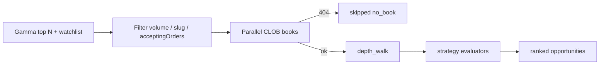

# Polymarket Arbitrage v2 — Design Spec

**Approved:** 2026-06-25  
**Scope:** Scan reliability + depth analysis (A), strategy expansion (B), UX & analytics (D)  
**Out of scope:** Live CLOB execution (C), cross-venue arbitrage, WebSocket streaming

**Builds on:** `docs/superpowers/specs/2026-06-23-polymarket-arb-design.md`

## User decisions

| Dimension | Choice |
|-----------|--------|
| Priority areas | A + B + D (no live trading in this release) |
| Architecture | Layered modules: `scanner` / `strategies` / `analytics`; `crypto_polymarket_arb.py` orchestrates |
| Paper trading | **binary_ask only**; `binary_bid` and `multi_ask` are scan + preview |
| Default `min_volume24hr_usd` | `5000` |
| Slug exclusions | `*-updown-*`, `*-5m-*` |

## Problem statement

v1 scans return ~100% CLOB 404 errors because Gamma `volume24hr` ranking surfaces short-lived Up/Down markets without order books. Edge metrics use top-of-book only, overstating profit and missing slippage. Only one strategy (`binary_ask`) is implemented. UI lacks depth breakdown, strategy filtering, and edge history.

## Goals

1. **Reliable scans:** Filter dead markets; classify skips vs errors; achieve >80% successful book fetches on default universe.
2. **Depth-aware metrics:** VWAP edge at configurable target size; slippage and fillable shares.
3. **Multi-strategy detection:** `binary_ask`, `binary_bid`, `multi_ask` in one scan pass.
4. **Analytics:** Persist edge history; expose trend and leaderboard APIs.
5. **UX parity with carry module:** Expected profit banners, strategy tabs, expandable depth rows, scan health stats.

## Non-goals

- `py-clob-client` live orders, wallet, EIP-712 signing
- Kalshi / cross-venue arbitrage
- WebSocket sub-second books
- Auto paper open on threshold
- Paper positions for `binary_bid` or `multi_ask`

---

## Metrics (v2)

### Shared book fields

| Field | Definition |
|-------|------------|
| `book_status` | `ok` \| `no_book` \| `incomplete` \| `error` |
| `depth_levels` | Number of ask (or bid) levels used in walk |
| `fillable_shares` | Max shares fillable on both legs at walked depth |
| `vwap_yes` / `vwap_no` | Volume-weighted average price per leg at target size |
| `edge_at_size_bps` | Fee-adjusted edge using VWAP, not top-of-book |
| `slippage_bps` | `edge_at_size_bps - edge_bps` (top vs depth) |
| `profit_at_size_usd` | `edge_at_size * min(target_size, fillable_shares)` |

Opportunity gate uses **depth metrics** when `use_depth_for_opportunity=true` (default).

### Strategy-specific

| `strategy_type` | Condition | Legs |
|-----------------|-----------|------|
| `binary_ask` | `vwap_yes + vwap_no < 1` after fees | Buy YES + Buy NO |
| `binary_bid` | `vwap_bid_yes + vwap_bid_no > 1` after fees | Sell YES + Sell NO (mint/settle assumption) |
| `multi_ask` | `Σ vwap_i < 1` for N≥3 outcomes | Buy all outcomes |

Each scan row includes `strategy_type`. One market may produce multiple rows (one per matching strategy).

---

## Config additions

| Param | Default | Description |
|-------|---------|-------------|
| `min_volume24hr_usd` | `5000` | Skip markets below 24h volume |
| `exclude_slug_patterns` | `["*-updown-*", "*-5m-*"]` | Glob patterns; matched against `slug` |
| `require_accepting_orders` | `true` | Require Gamma `acceptingOrders` |
| `skip_no_book` | `true` | CLOB 404 → `book_status=no_book`, not `error` |
| `use_depth_for_opportunity` | `true` | Gate on `edge_at_size_bps` |
| `depth_target_shares` | `100` | Target size for depth walk |
| `max_depth_levels` | `10` | Cap ladder levels per leg |
| `enabled_strategies` | `["binary_ask", "binary_bid", "multi_ask"]` | Subset to run |
| `min_outcomes_multi` | `3` | Minimum outcomes for `multi_ask` |

Existing v1 params unchanged.

---

## Market selection pipeline

**Gamma filter (`passes_market_filter`):**

- `volume24hr >= min_volume24hr_usd`
- `slug` does not match any `exclude_slug_patterns` (fnmatch)
- If `require_accepting_orders`: `acceptingOrders == true`
- Binary: exactly 2 token IDs; multi: 3+ token IDs for `multi_ask` path

**Book fetch:**

- Reuse parallel `ThreadPoolExecutor` (10 workers)
- HTTP 404 → `book_status=no_book`, increment `markets_skipped`
- Other errors → `book_status=error`, increment `markets_errors`
- Success → `markets_scanned_ok`

---

## Depth walk

`walk_ask_ladder(book, target_shares, max_levels)`:

1. Parse asks ascending by price.
2. Accumulate size until `target_shares` or levels exhausted.
3. Return `{vwap, filled_shares, levels_used, ladder: [{price, size, cum_size}]}`.

For binary strategies, walk YES and NO books independently; `fillable_shares = min(filled_yes, filled_no)`.

For `multi_ask`, walk each outcome book; `fillable_shares = min(filled_i)`.

---

## Module layout

| Module | Responsibility |
|--------|----------------|
| `crypto_polymarket_arb.py` | Config, persistence, paper positions, `scan_markets` orchestration |
| `crypto_polymarket_scanner.py` | Gamma fetch/filter, CLOB books, depth walk, `BookStatus` |
| `crypto_polymarket_strategies.py` | `eval_binary_ask`, `eval_binary_bid`, `eval_multi_ask` |
| `crypto_polymarket_analytics.py` | `edge_history.jsonl`, trend, leaderboard |

---

## Storage

| Path | Content |
|------|---------|
| `data/crypto/polymarket/scans/*.json` | Full scan payloads with `strategy_counts`, skip/error counts |
| `data/crypto/polymarket/edge_history.jsonl` | `{ts, condition_id, strategy_type, edge_bps, edge_at_size_bps, profit_at_size_usd}` |
| `data/crypto/polymarket/opportunities.jsonl` | Extended with strategy fields |
| Existing `positions/`, `events.jsonl`, `config.json` | Unchanged schema; paper open still `binary_ask` |

---

## HTTP API (new / changed)

| Method | Path | Description |
|--------|------|-------------|
| GET | `/crypto/polymarket/scan` | Returns v2 payload; items include `strategy_type`, depth fields |
| GET | `/crypto/polymarket/analytics/edge-trend` | `?condition_id=&hours=24` → time series |
| GET | `/crypto/polymarket/analytics/leaderboard` | `?limit=20&hours=168` → top markets by hit count / best edge |
| GET | `/crypto/polymarket/preview` | Uses depth-based profit for `binary_ask`; read-only preview for other strategies |
| PUT | `/crypto/polymarket/config` | Accepts new config fields |

Scan summary fields added:

- `strategy_counts: {binary_ask: N, binary_bid: M, multi_ask: K}`
- `markets_scanned_ok`, `markets_skipped`, `markets_errors`

---

## Frontend

**CryptoPolymarketView.vue** enhancements:

1. **Strategy tabs:** 全部 / 二元买入 / 二元卖出 / 多结果
2. **Scan health bar:** `scanned_ok / skipped / errors` + duration
3. **Table columns:** `strategy_type`, `edge_at_size_bps`, `fillable_shares`, `slippage_bps`
4. **Expand row:** depth ladder table per leg; expected profit banner (@ `depth_target_shares`)
5. **Edge sparkline:** per-row mini chart from `edge-trend` API (last 24h)
6. **Leaderboard panel:** sidebar or card with top markets
7. **Positions:** unrealized PnL + `edge_delta_bps` (existing live_status extended)

Paper open button visible only when `strategy_type === 'binary_ask'`.

---

## Error handling

- Partial scan success: return items with mixed `book_status`; never fail entire scan
- Gamma down: return cached `latest.json` if within dedupe window
- Analytics empty: return `{items: []}` not 404
- Preview on `binary_bid`/`multi_ask`: show estimated PnL, disable open with tooltip

---

## Testing

| File | Coverage |
|------|----------|
| `test_crypto_polymarket_scanner.py` | filter, depth walk, book status |
| `test_crypto_polymarket_strategies.py` | three strategy evaluators |
| `test_crypto_polymarket_analytics.py` | history append, trend, leaderboard |
| `test_crypto_polymarket_arb.py` | integration scan with mocks |
| `test_crypto_polymarket_routes.py` | new analytics routes |

Fixtures: `polymarket_clob_book_deep.json`, `polymarket_gamma_multi_outcome.json`

---

## Phased delivery

| Phase | Deliverable |
|-------|-------------|
| 1 | Market filter + book status classification → scans return real edges |
| 2 | Depth walk + depth metrics + depth-based preview |
| 3 | `binary_bid` + `multi_ask` strategies |
| 4 | Analytics API + UI tabs/expand/sparkline/leaderboard |

---

## Security

- Read-only public APIs; no keys
- UI disclaimer unchanged: research/paper only
